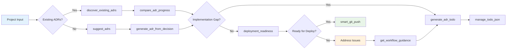

# MCP ADR Analysis Server Architecture Flow

This document shows the system architecture and data flow using Mermaid diagrams.

## System Architecture Overview

## Tool Execution Flow

## Decision Flow Architecture

## Security Analysis Flow

## Deployment Readiness Pipeline

These diagrams illustrate the comprehensive workflow and architecture of the MCP ADR Analysis Server, showing how different components interact to provide AI-powered architectural analysis and decision support.

